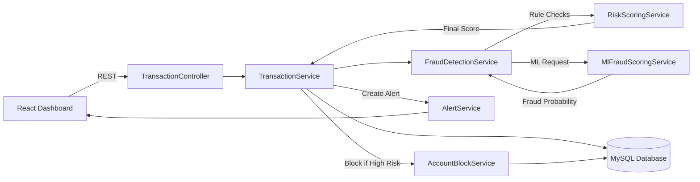
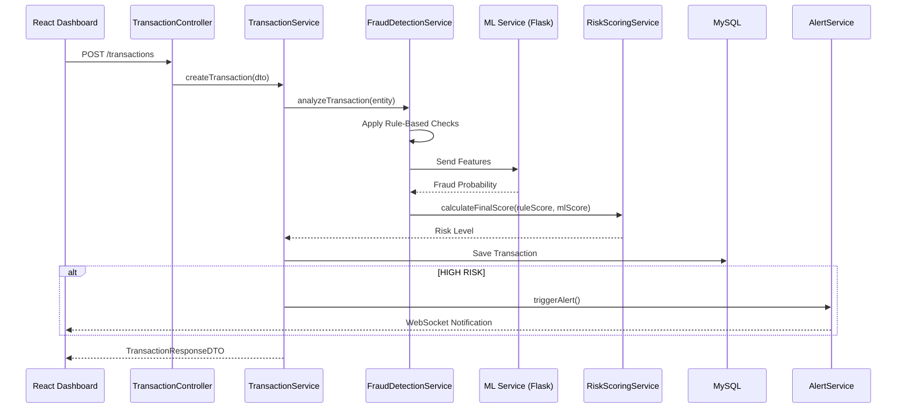
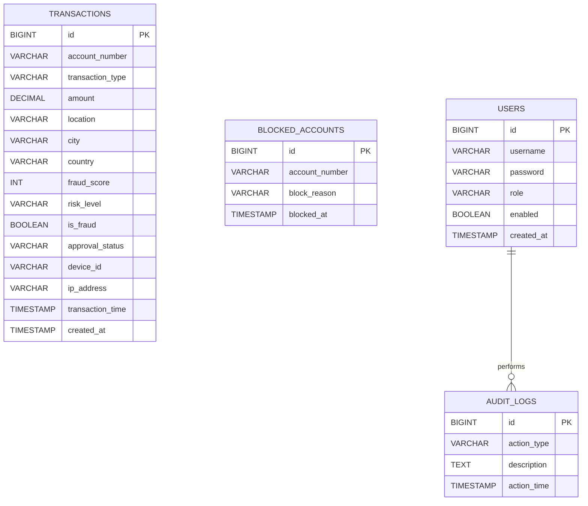
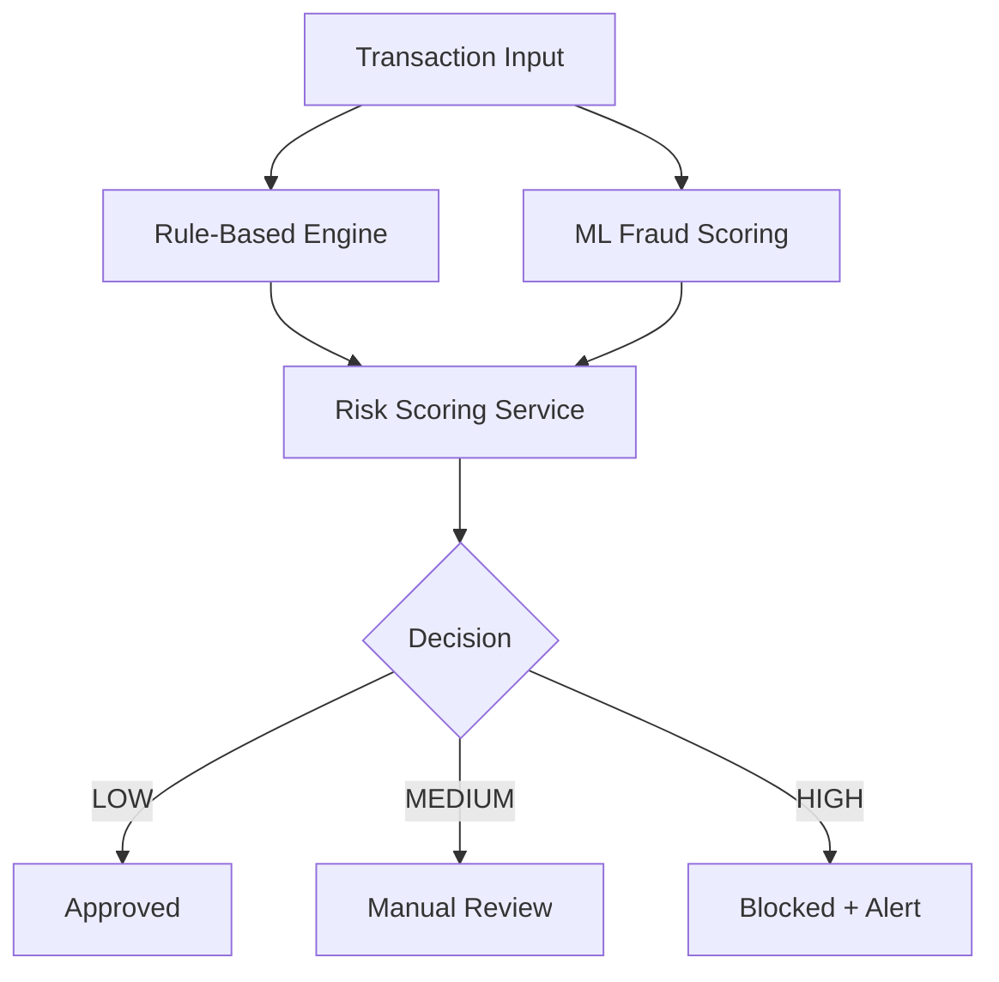
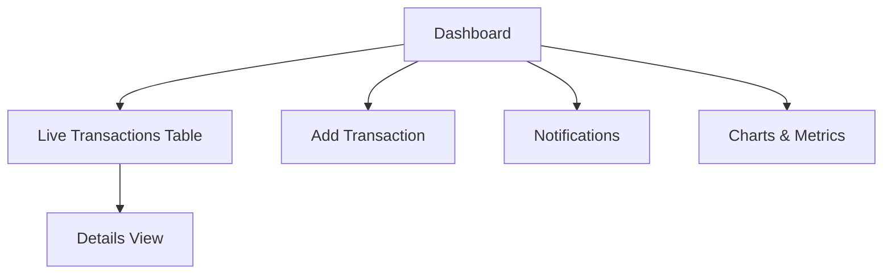

# DIGITAL_BANKING_FRAUD_DETECTION_AND_SIMULATION_ENGINE

[](https://openjdk.org/)
[](https://spring.io/projects/spring-boot)
[](https://www.mysql.com/)
[](https://reactjs.org/)
[](https://scikit-learn.org/)


---

## 🌟 Project Overview

This project implements a **real-time digital banking fraud detection system** using a **hybrid approach**:

* **Rule-based fraud detection** for deterministic, explainable fraud patterns
* **Machine learning–based fraud scoring** for probabilistic and behavioral fraud detection

The system is composed of:

* **React frontend** for fraud analysts
* **Spring Boot backend** as the fraud decision engine
* **Python (Flask) ML microservice** for fraud probability prediction
* **MySQL database** for transactional and audit data

---

## 🧱 System Architecture (Detailed & Real)


---

## 🔄 End-to-End Transaction Flow (Code-Level)



---

## 📂 Backend Folder Structure (Exact)

```
com.bank.fraud
│
├── controller
│   ├── TransactionController.java
│   ├── AnalyticsController.java
│   └── NotificationController.java
│
├── service
│   ├── TransactionService.java
│   ├── FraudDetectionService.java
│   ├── RiskScoringService.java
│   ├── AccountBlockService.java
│   ├── AlertService.java
│   └── AnalyticsService.java
│
├── repository
│   ├── TransactionRepository.java
│   ├── UserRepository.java
│   ├── BlockedAccountRepository.java
│   └── AuditLogRepository.java
│
├── model
│   ├── Transaction.java
│   ├── User.java
│   ├── BlockedAccount.java
│   └── AuditLog.java
│
├── dto
│   ├── TransactionRequestDTO.java
│   ├── TransactionResponseDTO.java
│   ├── FraudScoreDTO.java
│   └── AnalyticsDTO.java
│
├── ml
│   ├── MlFraudScoringService.java
│   └── ModelFeatureMapper.java
│
├── config
│   ├── SecurityConfig.java
│   ├── JwtAuthFilter.java
│   └── WebSocketConfig.java
│
└── DigitalBankingFraudDetectionApplication.java
```

---

## 🗄️ Database Schema (NO MISSING FIELDS)


---

## 🤖 Fraud Detection Logic (Exact)



### Rule Examples

* Amount threshold
* Velocity check
* Late-night transactions
* New location / device

### ML

* Logistic Regression - Classification with probability
* Output: fraud probability (0–100)

---

## 🖥️ Frontend Dashboard (What You Actually Built)



Features:

* Risk color coding
* Expandable details
* Auto & manual refresh
* CSV export
* Real-time alerts

---

## ⚡ Performance & 🔐 Security (Realistic)

### Performance

| Area       | Implementation        |
| ---------- | --------------------- |
| APIs       | REST                  |
| DB         | Indexed queries       |
| Processing | Async services        |
| ML         | External microservice |
| UI         | WebSockets            |

### Security

| Area  | Implementation   |
| ----- | ---------------- |
| Auth  | JWT              |
| Roles | Analyst / Admin  |
| Data  | HTTPS            |
| Audit | AuditLog table   |
| Fraud | Account blocking |

---

## 🚀 Running the Project

```bash
# Backend
mvn spring-boot:run

# ML service
python app.py

# Frontend
npm install
npm start
```

---

## 👨‍💻 Author

**Sree Raksha S P**
GitHub: [https://github.com/sreeraksha0123](https://github.com/sreeraksha0123)
LinkedIn: [https://www.linkedin.com/in/sreeraksha0123](https://www.linkedin.com/in/sreeraksha0123)

---

### 🔒 Secure Banking • ⚡ Real-Time Detection • 📊 Explainable Decisions

